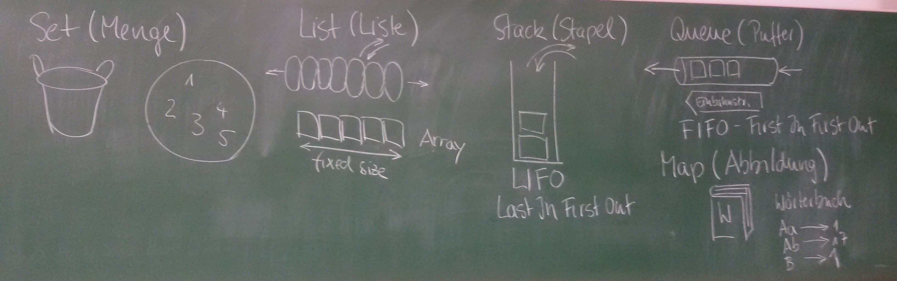

// == Collections
:solution:

[TIP]
====
Hinweis: Die `forEach`-Methode erwartet einen Lambda-Ausdruck. Das kommt noch.
====

### Frage
Welche besondere Bedeutung hat das Interface `Iterable` in Java?

ifdef::solution[]
.Antwort
Wenn eine Klasse `Iterable` implementiert, kann man sie in einer for-each-Schleife verwenden.
endif::solution[]

### Frage
Sie wollen `ArrayList` verwenden und dürfen nicht vergessen, welches Paket zu importieren?

ifdef::solution[]
.Antwort
`java.util`
endif::solution[]

### Frage
Welche dieser Klassen implementiert das Interface `Collection`?

- [ ] HashSet
- [ ] LinkedList
- [ ] Stack
- [ ] TreeMap

ifdef::solution[]
.Antwort
`TreeMap` ist die einzige Klasse aus der Liste, die keine `Collection` ist (obwohl sie zum _Collection Framework_ gehört).
endif::solution[]

### Frage
Auf S.295 oben heißt es: "... bietet sich der Einsatz einer `List`-Klasse an." Ist `List` eine Klasse?

ifdef::solution[]
.Antwort
Nein, `List` ist ein Interface.
endif::solution[]

### Frage
----
Set<Integer> s = new HashSet<Integer>();
for(int i = 0; i < 100; i++) {
 int x = new Random().nextInt();
 if (! s.contains(x)) s.add(x);
}
----
Was kann hier verbessert werden?

ifdef::solution[]
.Antwort
Das `if (! s.contains(x))` kann man sich sparen, da ein `Set` sowieso jedes Element nur einmal enthalten kann.

----
Set<Integer> s = new HashSet<Integer>();
for(int i = 0; i < 100; i++) {
  s.add(new Random().nextInt());
}
----
endif::solution[]

### Frage
Was bedeutet _First in - First out_?

ifdef::solution[]
.Antwort
Das Element, das zuerst hinzugefügt wurde wird als erstes wieder aus der Datenstruktur entfernt. Das ist z.B. bei einer Queue der fall.
endif::solution[]

### Frage
Warum gibt es für eine Schnittstelle wie z.B. `List` mehrere Implementierungen wie z.B. `ArrayList` oder `Stack`? Woher soll ich wissen, welche Implementierung ich nutzen soll?

ifdef::solution[]
.Antwort
Die Implementierungen haben verschiedene Laufzeiten für die Ausführung der einzelnen Methoden. Man kann damit also abhängig davon welche Methoden man am häufigsten braucht entscheiden welche Implementierung besser für das eigene Problem funktioniert.
endif::solution[]

### Frage
Den Interfaces `Set`, `List`, `Stack`, `Queue` und `Map` liegen anschauliche Vorstellungen zugrunde. Zeichnen Sie für jedes Interface ein Bild, was die zugrunde liegende Abstraktion illustriert. [Das soll helfen, sich zu erinnern, was die Schnittstellen tun.]

ifdef::solution[]
.Antwort

* Set (Menge): Korb oder Kreis mit ungeordneten Elementen
* List (Liste): Regenwurm mit aneinanderhängenden Segmenten
* Stack (Stapel): Gefäß, in das man nur von oben Sachen hineinlegen oder entfernen kann (LIFO)
* Queue (Puffer): Warteschlange, Einbahnstraße (FIFO)
* Map (Abbildung): Telefonbuch, Wörterbuch

endif::solution[]

### Frage
Warum kann man bei einer `Collection` die Variante der `for`-Schleife nutzen, die sich foreach-Schleife nennt?

ifdef::solution[]
.Antwort
Weil `Collection` das Interface `Iterable` erweitert.
endif::solution[]

### Frage
Warum sollten Sie davon Abstand nehmen, `Collection`s selber zu implementieren?

ifdef::solution[]
.Antwort
Weil die bestehenden Implementierungen sehr effizient und ausgeklügelt sind.
endif::solution[]

### Frage
Warum ist es oft attraktiv, wenn möglich, eine Schnittstelle statt eine Klasse als Typ einer Variablen anzugeben?

ifdef::solution[]
.Antwort
Wenn man eine Schnittstelle verwendet, erhöht man die Wiederverwendbarkeit des Codes und man hat die Möglichkeit, später noch die konkrete Implementierung zu wechseln.
endif::solution[]

### Frage
Warum ist es bei Collections manchmal sinnvoller, eine Variable mit der implementierenden Klasse statt dem Interface zu deklarieren.

ifdef::solution[]
.Antwort
Manchmal möchte man Methoden einer Klasse verwenden, die nicht im Interface angegeben sind. Außerdem gibt es Fälle in denen eben nur eine konkrete Implementierung sinn macht (z.B. der `Stack` beim UPN-Taschenrechner).
endif::solution[]

### Frage
----
List<Integer> lst = ...;
for(int i = 0; i < lst.size(); i++) {
 if (lst.get(i) < 0) lst.remove(i);
}
----
Ojemine! Aus welchem Grunde?

ifdef::solution[]
.Antwort
Diese Implementierung überspringt Elemente in der Liste. Besser ist es hier einen `Iterator` zu verwenden.
endif::solution[]

### Frage
Herr Kofler benennt fünf statische Methoden der Klasse `Collections`, die nützlich sind -- und oft gebraucht werden.

ifdef::solution[]
.Antwort

* `min`
* `max`
* `fill`
* `binarySearch`
* `sort`
endif::solution[]

### Frage
Dem Kopf der `for`-Schleife fehlt doch was, oder?

`for(Iterator<Integer> it = s.iterator(); it.hasNext(); )`

Kann so eine `for`-Schleife überhaupt funktionieren?

ifdef::solution[]
.Antwort
Der Kopf besitzt keine Schrittanweisung. So eine Schleife kann man durchaus definieren. Dann muss man aber die Schrittanweisung selbst im Körper der Schleife realisieren (in diesem Beispiel durch den Aufruf von `it.next()`).

In so einem Fall ist eigentlich eine `while`-Schleife sinnvoller.
endif::solution[]

### Frage
Listen Sie freisprachlich auf (jeweils ein Verb), welche Fähigkeiten eine `Collection` mit sich bringt.

ifdef::solution[]
.Antwort

* Größe ermitteln
* Elemente hinzufügen
* Elemente entfernen
* Prüfen ob ein Element in der `Collection` enthalten ist
endif::solution[]

### Frage
Was ist der wesentliche Unterschied zwischen einer Liste (`List`) und einer Menge (`Set`)?

ifdef::solution[]
.Antwort
Eine Liste kann mehrere gleiche Elemente enthalten. Außerdem hat sie eine definierte Ordnung.
endif::solution[]

### Frage
`Set` definiert `add` mit dem Rückgabetyp `boolean`. Warum?

ifdef::solution[]
.Antwort
Wenn das Element schon enthalten ist, fügt `add` das Element nicht hinzu. Um diesen Fall zu erkennen, wird `false` zurückgegeben und `true` sonst.
endif::solution[]

### Frage
In welcher Klasse finden Sie eine Methode um Listen zu sortieren?

ifdef::solution[]
.Antwort
`java.util.Collections`
endif::solution[]

### Frage
Die Implementierung `HashSet<T>` erwartet, das der parametrisierte Typ zwei Methoden "sauber" implementiert hat? Welche sind das?

ifdef::solution[]
.Antwort
`equals` und `hashSet`
endif::solution[]

### Frage
Der Unterschied zwischen einem `LinkedHashSet` und einem `HashSet` ist?

ifdef::solution[]
.Antwort
Das `LinkedHashSet` erhält die chronologische Reihenfolge.
endif::solution[]

### Frage
Was ist ein `TreeSet`?

ifdef::solution[]
.Antwort
Ein `TreeSet` sortiert seine Element intern.
endif::solution[]

### Frage
`Set<java.awt.Point> pset = new TreeSet<java.awt.Point>();` Schon verloren. Wie kommt's?

ifdef::solution[]
.Antwort
`java.awt.Point` implementiert das Interface `Comparable` nicht, das aber nötig ist damit `TreeSet` seine Elemente sortieren kann. Man müsste dem Konstruktor einen `Comparator` übergeben, um das Problem zu lösen.
endif::solution[]

### Frage
Welchen Wert hat `new ArrayList<Integer>(10).size()`?

ifdef::solution[]
.Antwort
`0`
endif::solution[]

### Frage
Wann sollte man der `LinkedList` den Vorrang vor `ArrayList` geben?

ifdef::solution[]
.Antwort
Wenn man sehr häufig Elemente an beliebiger Stelle einfügen oder löschen möchte.
endif::solution[]

### Frage
Was heißt "FIFO", was "LIFO"? (Das sind zwei ganz beliebte Abkürzungen.)

ifdef::solution[]
.Antwort

* FIFO = _First in - First out_
* LIFO = _Last in - First out_
endif::solution[]

### Frage
Wie sollte man am Besten eine Liste oder ein Set kopieren?

ifdef::solution[]
.Antwort
Mit einem _Copy-Konstruktor_ (d.h. ein Konstruktor, der eine `Collection` übernimmt und alle Elemente aus dieser Collection dem neu erstellten Objekt hinzufügt).
endif::solution[]

// Ab hier geht es um Maps (14.7)

### Frage
Wenn Sie über Schlüssel-Wert-Paare einer Map iterieren wollen (und beides brauchen), können Sie die Methode `entrySet` verwenden. Der Rückgabetyp dieser Methode ist `Set<Map.Entry<K,V>>`. Erklären Sie diesen Typ.

ifdef::solution[]
.Antwort
Der Rückgabetyp ist ein `Set`, dessen Elemente den Typ `Map.Entry<K,V>` haben. `Map.Entry` ist ein _inneres Interface_ des Interface `Map`. Das ist das gleiche Prinzip wie bei einer inneren Klasse. `Map.Entry` ist außerdem generisch, damit man den Typ des Schlüssels `K` und den Typ des Werts `V` angeben kann.
endif::solution[]

### Frage
Ist `Map.Entry` als `static` deklariert oder nicht? Woran sieht man das?

ifdef::solution[]
.Antwort
Da `Entry` ein Interface ist, macht es gar keinen Unterschied, ob es `static` ist oder nicht. Tatsächlich wird das Schlüsselwort `static` sogar implizit ergänzt. Das kann man auch sehen an dem Fehler, den der Compiler bei folgendem Konstrukt angibt:

----
class A {
  int x;
  interface B {
    default void foo() {
      System.out.println(x);
    }
  }
}
----
endif::solution[]

### Frage
Die `Map`-Schnittstelle gehört nicht zu den Collections. Was könnte der Grund dafür sein?

ifdef::solution[]
.Antwort
Im Gegensatz zu einer normalen `Collection` handelt es sich bei den Elementen einer Map nicht um einzelne Werte, sondern um Schlüssel-Wert-Paare. Wenn `Map` das Interface `Collection` und damit auch `Iterable` implementieren würde, müsste man sich für eine Sicht bei der Iteration entscheiden: Nur Schlüssel, nur Werte oder Schlüssel-Wert-Paare. Die Java-Entwickler haben diese Entscheidung dem Benutzer überlassen mit den Methoden `keySet`, `values` und `entrySet`.
endif::solution[]

### Frage
Die `Map<K,V>`-Schnittstelle hat zwei wichtige Methoden `put` und `get`. Was vermuten Sie, wie die Methodenköpfe zu den beiden Methoden aussehen?

ifdef::solution[]
.Antwort
Vermuten würde man das folgende:

----
void put(K key, V value);
V get(K key);
----

Die tatsächlichen Methodenköpfe sehen aber wie folgt aus:

----
V put(K key, V value);
V get(Object key);
----

`put` gibt tatsächlich den alten Wert zurück, der unter dem Schlüssel gespeichert war oder `null` falls der Schlüssel noch nicht existierte.

`get` übernimmt seltsamerweise ein `Object`. Vermutlich ist das der Fall, da `get` über die `equals`-Methode definiert ist, die ebenfalls ein beliebiges `Object` akzeptiert. Eine sauberere Deklaration im Sinne der Typsicherheit wäre aber tatsächlich `V get(K key);` gewesen.

Tatsächlich gibt die Java-API den Grund an, dass man auch ein Objekt eines anderen Typs als des Schlüsseltyps verwenden kann um Elemente aus der Map zu identifizieren. Es muss nur gegeben sein, dass `key.equals(k)` für den zu findendenden Schlüssel `k` in der Map `true` ergibt. Eine sinnvolle Anwendung dieser Eigenschaft wäre z.B. wenn man ein Interface `Point` mit den Implementierungen `CarthesianPoint` und `PolarPoint` hat. In diesem Fall könnte ein `CarthesianPoint` mit `equals` mit einem `CarthesianPoint` vergleichbar sein. Dann könnte man eine Map vom Typ `Map<CarthesianPoint,Integer>` definieren, bei der man aber auch `PolarPoint` Objekte verwenden kann, um auf die in der Map enthaltenen Werte zugreifen kann.

////
Codebeispiel: (TODO)
----
class Rad {
  float rad;
  public boolean equals(Object other) {
    if(other instanceof Rad) {
      return Math.abs(rad - ((Rad)other).rad) < 0.0001;
    } else if (other instanceof Deg) {
      return ((Deg) other).toRad().equals(this);
    }
  }
}

class Deg {
  float deg;
  public boolean equals(Object other) {

  }
}
----
////
endif::solution[]

### Frage
----
class A { int x; A(int x) {this.x = x; } }
Map<A, Integer> myMap = new HashMap<>();
myMap.put(new A(1), 1);
myMap.put(new A(1), 2);
----

Was ergibt `myMap.size()`?

ifdef::solution[]
.Antwort
Das Ergebnis ist `2`, da die Klasse `A` keine `equals`-Methode implementiert und damit die `equals`-Implementierung von `Object` verwendet. Die Implementierung von `equals` alleine reicht hier übrigens nicht aus, da eine `HashMap` überhaupt erst `equals` aufruft, wenn beide Objekte schon den gleichen `hashCode` haben. Genau genommen müssen Sie also für dieses Beispiel `hashCode` _und_ `equals` überschreiben.

Der Code hat auch noch ein ganz anderes Problem, denn man kann nicht mehr auf die Schlüssel zugreifen, die in der Map gespeichert wurde, da man keine Referenz mehr auf den Schlüssel hat.
endif::solution[]

### Frage
Zur `Map<K,V>`-Schnittstelle finden Sie `boolean containsKey(Object key)` deklariert. Komisch? Komisch! Was ist an der Deklaration überraschend?

ifdef::solution[]
.Antwort
Ähnlich wie bei `get` ist der Parameter von `containsKey` vom Typ `Object` statt vom Schlüsseltyp `K`. (Siehe dazu die Diskussion der Frage zu Deklaration von `get`.)
endif::solution[]

### Frage
Was unterscheidet eine `HashMap` von einer `LinkedHashMap`? Welche der beiden Implementierungen verwenden Sie im Regelfall?

ifdef::solution[]
.Antwort
`LinkedHashMap` bietet eine Ordnung der Schlüssel-Wert-Paare, die man aber in den meisten Fällen nicht braucht. Daher verwendet man im Regelfall `HashMap`.
endif::solution[]

### Frage
Welche Probleme ergeben sich, wenn die Schlüssel einer Map veränderliche Objekte sind?

ifdef::solution[]
.Antwort
Das Verhalten der Map wird dadurch undefiniert. Es könnten sogar zwei Schlüssel in der Map existieren, bei denen der Vergleich mit `equals` den Wert `true` ergibt.
endif::solution[]

### Frage
Wenn man über den Inhalt einer Map iterieren möchte gibt es drei Möglichkeiten an ein Objekt zu gelangen das `Iterable` implementiert. Diese Möglichkeiten entsprechen jeweils einer anderen Sicht auf den Inhalt der Map. Welche sind das?

ifdef::solution[]
.Antwort
Alle Schlüssel mit `keySet`, alle Werte mit `values` oder alle Schlüssel-Wert-Paare mit `entrySet`;
endif::solution[]

### Frage
Die Map-Methode `put` liefert einen Wert zurück. Weshalb ist Sie nicht einfach als `void` deklariert?

ifdef::solution[]
.Antwort
Die Methode gibt den alten Wert zurück, der unter dem gegebenen Schlüssel gespeichert war (oder `null` falls der Key noch nicht existierte).
endif::solution[]

### Frage
Angenommen, Sie haben eine `Map` namens `book` vom Typ `HashMap<ISBN,Book>`. Schreiben Sie den Kopf einer `for`-Schleife, die über alle ISBNs iteriert.

ifdef::solution[]
.Antwort
----
for(ISBN isbn: book.keySet())
----
endif::solution[]
